# MEGA Rehberi
## İndirme
MEGA'yı indirmek için (https://www.megasoftware.net) bağlantısına gidin ve sistem özelliklerinizi seçtikten sonra "DOWNLOAD" butonuna tıklayın.

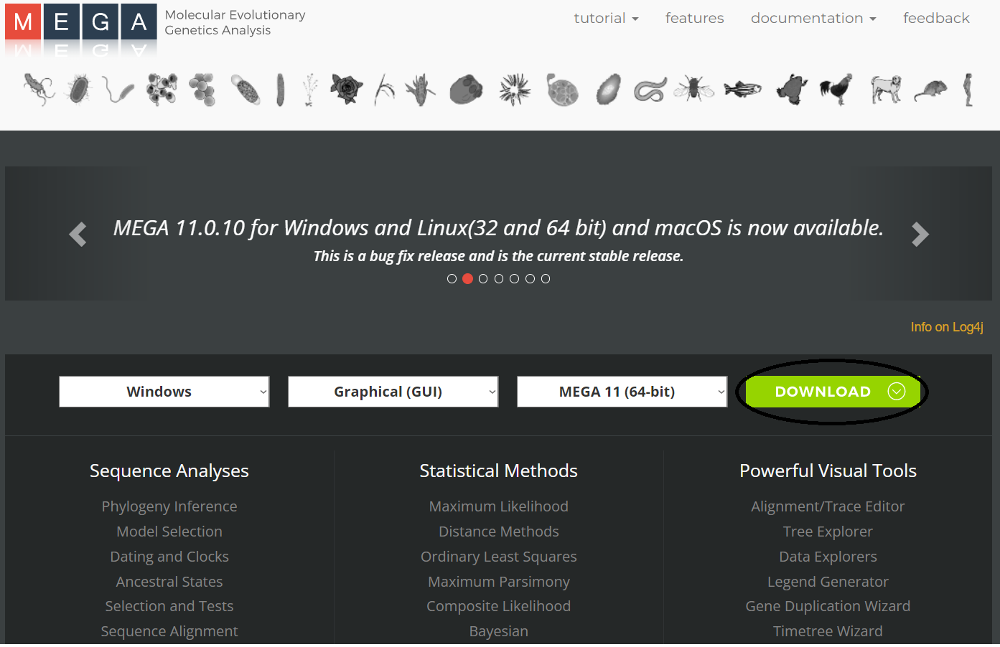

Gelen ekranı aşağıya indirin ve "Accept" butonuna tıklayarak devam edin.

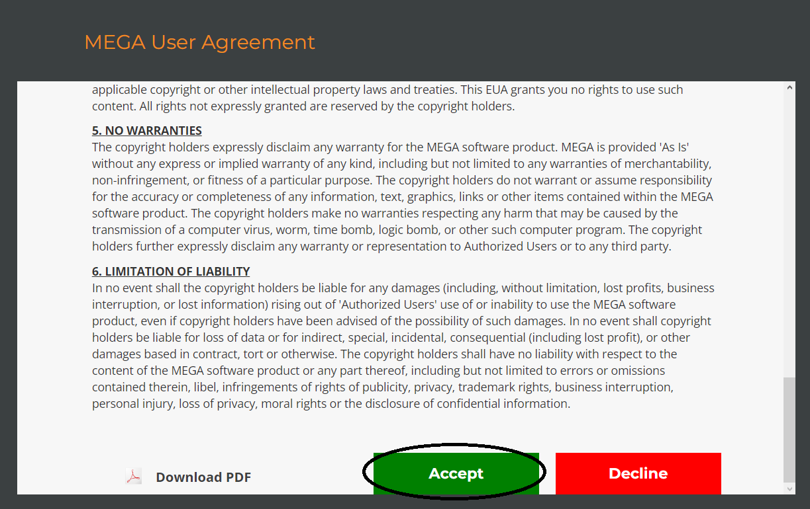

Açılan ekrandaki gerekli bilgileri kendinize uygun bir şekilde doldurun ve "DOWNLOAD" butonuna tıklayın.

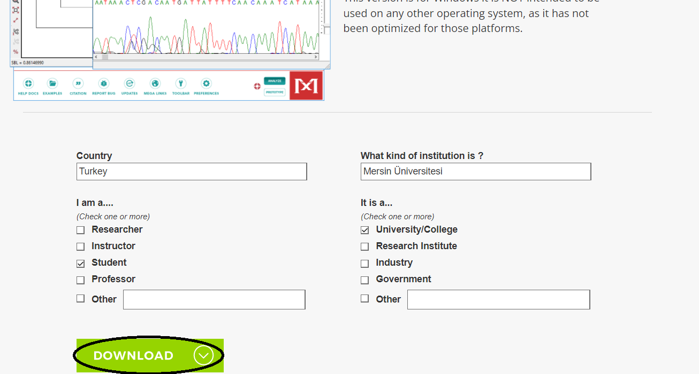

Açılan ekrandan indirmek istediğiniz konumu seçin ve "kaydet" seçeneğine tıklayın.

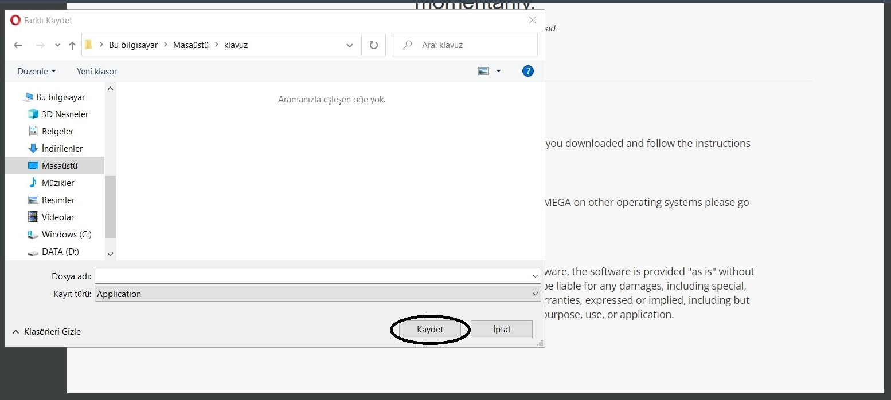

Bu aşamada "Mega_setup.exe" dosyası indiriliyor olması lazım.

## Kurulum

İndirdiğiniz "Mega_setup.exe" dosyasını çift tıklayın ve "Çalıştır" seçeneğine tıklayın.

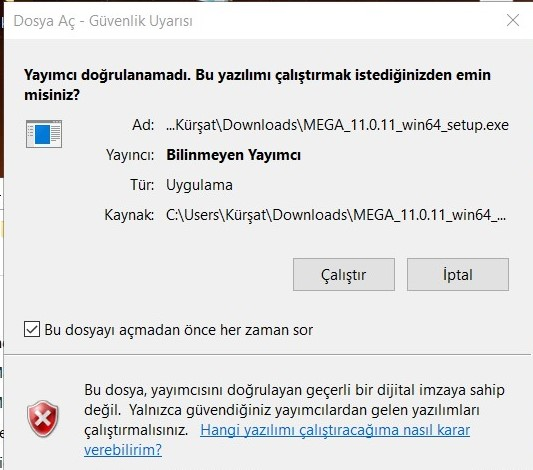

İlk seçeneği seçerek "Next" butonuna tıklayın. 

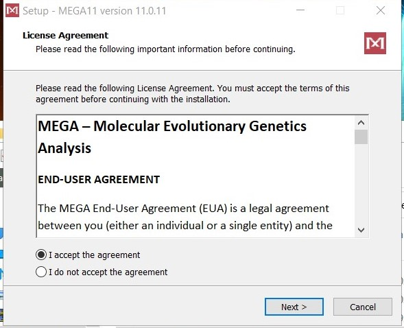

"Browse" butonuna tıklayarak kurulumu yapmak istediğiniz konumu seçin ve "Next" seçeneğine tıklayarak devam edin.

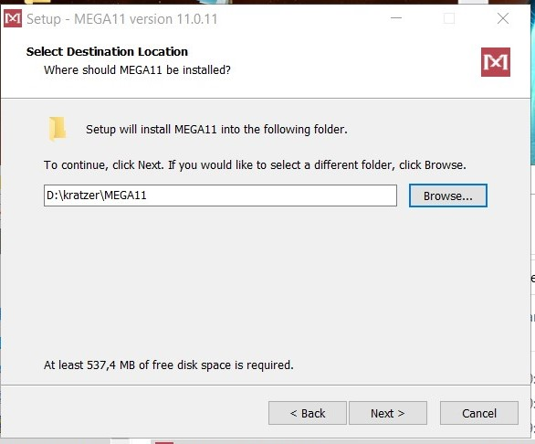

"Next" seçeneğine tıklayarak devam edin.

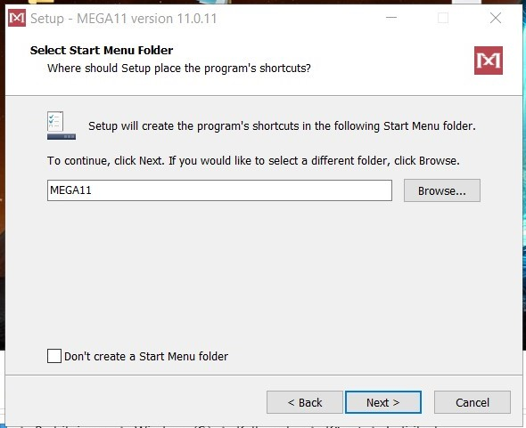

Seçeneklere tik atarak "Next" seçeneği ile devam edin.

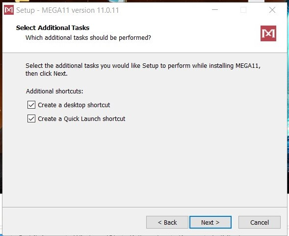

Seçeneklere tik atarak "Next" seçeneği ile devam edin.

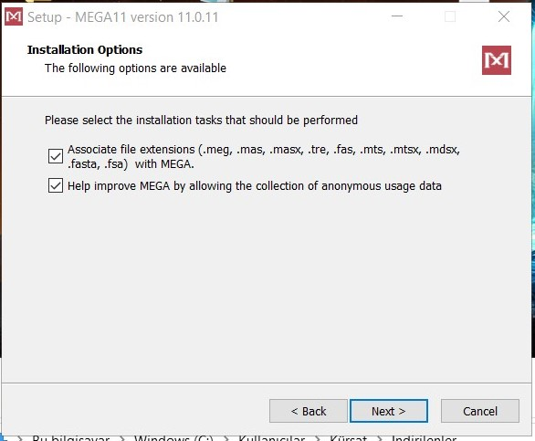

"Install" butonuna tıklayarak kurulumu başlatın.

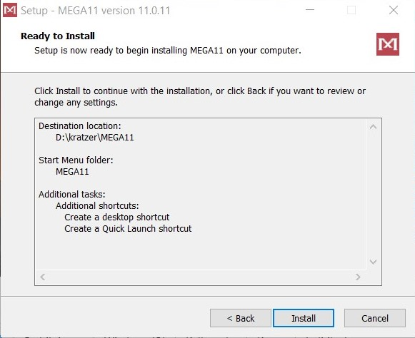

Kurulum bittikten sonra "Finish" butonuna tıklayın ve kurulumu bitirin. Kurulum bittikten sonra program artık kullanılmaya hazır.

## Analiz Materyalinin İndirilmesi

İlk olarak (https://www.ncbi.nlm.nih.gov) adresine gidin ve veri tabanı seçeneğini "Nucleotide" olarak ayarlayın. Ardından çalışmak istediğiniz diziyi "Search" kısmına yazın ve aratın. Daha sonra çıkan arama sonuçlarından birini seçin.

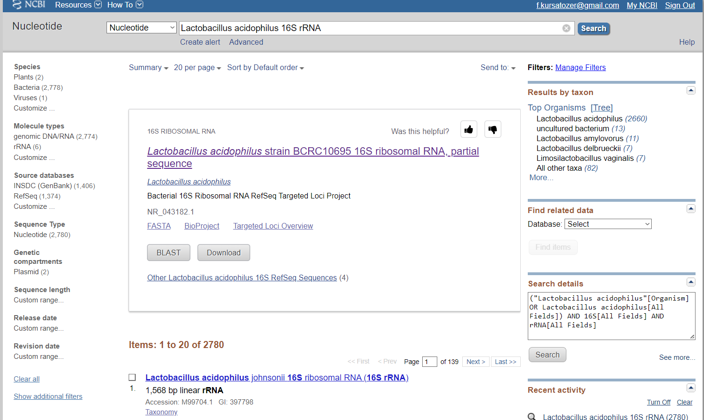

Seçtiğiniz arama sonucunun başlığının sol üstünde yer alan "Send to:" seçeneğine tıklayın
Açılan pencereden: 
"Choose Destination" seçeneğini "File" olarak,
"Format" seçeneğini "FASTA" olarak ayarlayın ve "Create File" butonuna basın.

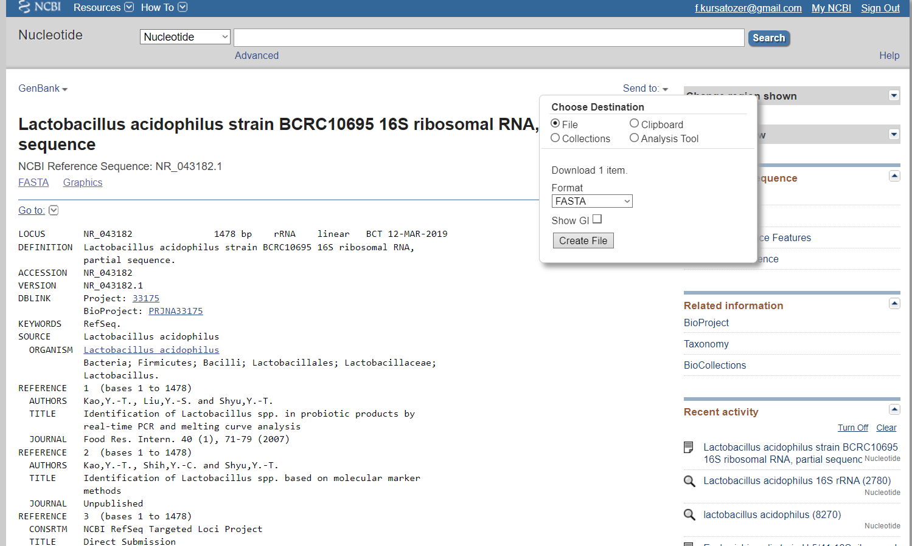

FASTA dosyası bilgisayarınızın indirilenler kısmına inmiş olmalı. Fasta dosyasını burdan kendi proje klasorünüze aktarabilirsiniz.

## Blast Analizi

İlk olarak (https://blast.ncbi.nlm.nih.gov/Blast.cgi) adresine gidin ve "Nucleotide BLAST" seçneğini seçin.

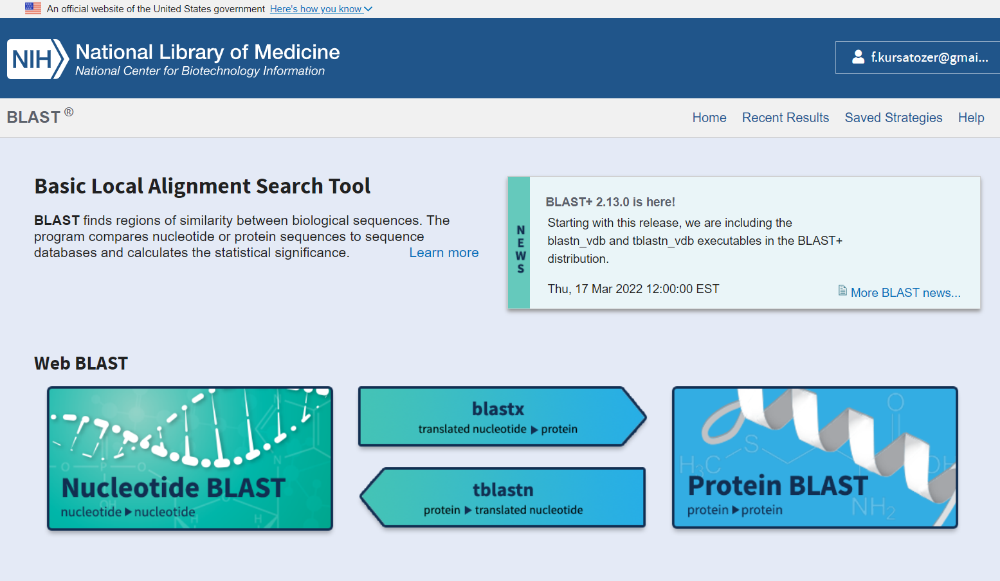

Bu ekranda dosya seç butonuna tıklayın.

Açılan pencereden "Tüm dosyaları göster" seçeneğine tıklayın.
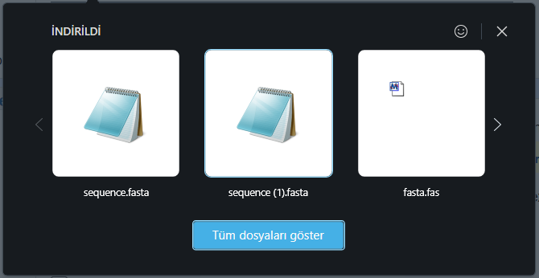

Açılan ekrandan indirdiğiniz FASTA dosyasının bulunduğu klasöre gidin; FASTA dosyasını seçin ve "Aç" butonuna basın.
Böylece FASTA dosyanızı siteye analiz için yüklemiş oldunuz.
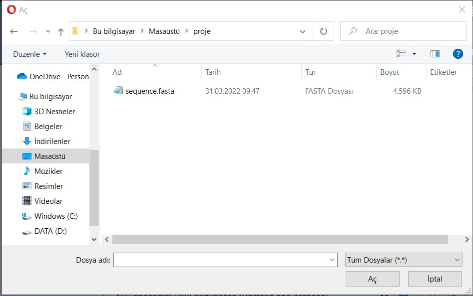

Burdaki seçeneklerden çalışmanıza uygun arama kümesini seçin.
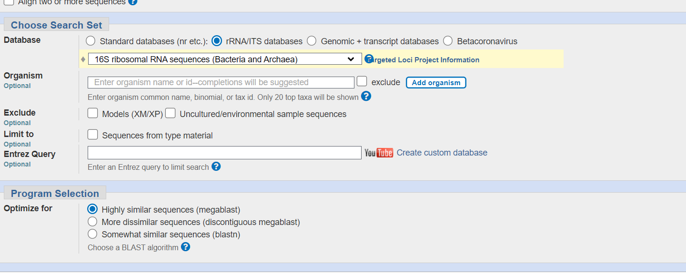

Burdaki seçeneklerden de çalışmanıza uygun parametreleri seçin ve "BLAST" butonuna tıklayın.
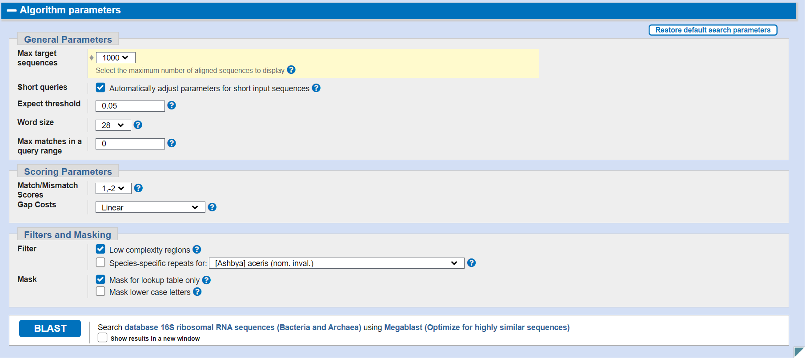
