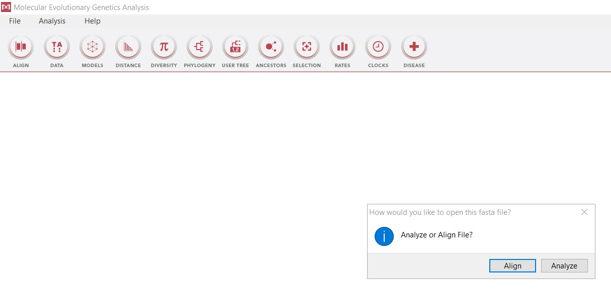
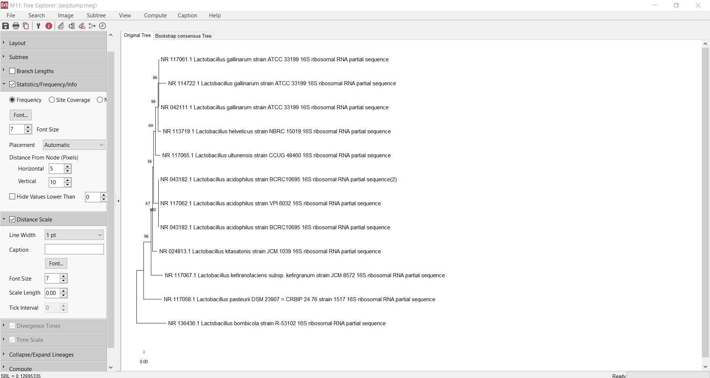

# MEGA Rehberi
## İndirme
MEGA'yı indirmek için (https://www.megasoftware.net) bağlantısına gidin ve sistem özelliklerinizi seçtikten sonra "DOWNLOAD" butonuna tıklayın.

Gelen ekranı aşağıya indirin ve "Accept" butonuna tıklayarak devam edin.

Açılan ekrandaki gerekli bilgileri kendinize uygun bir şekilde doldurun ve "DOWNLOAD" butonuna tıklayın.

Açılan ekrandan indirmek istediğiniz konumu seçin ve "kaydet" seçeneğine tıklayın.

Bu aşamada "Mega_setup.exe" dosyası indiriliyor olması lazım.

## Kurulum

İndirdiğiniz "Mega_setup.exe" dosyasını çift tıklayın ve "Çalıştır" seçeneğine tıklayın.

İlk seçeneği seçerek "Next" butonuna tıklayın. 

"Browse" butonuna tıklayarak kurulumu yapmak istediğiniz konumu seçin ve "Next" seçeneğine tıklayarak devam edin.

"Next" seçeneğine tıklayarak devam edin.

Seçeneklere tik atarak "Next" seçeneği ile devam edin.

Seçeneklere tik atarak "Next" seçeneği ile devam edin.

"Install" butonuna tıklayarak kurulumu başlatın.

Kurulum bittikten sonra "Finish" butonuna tıklayın ve kurulumu bitirin. Kurulum bittikten sonra program artık kullanılmaya hazır.

## Analiz Materyalinin İndirilmesi

İlk olarak (https://www.ncbi.nlm.nih.gov) adresine gidin ve veri tabanı seçeneğini "Nucleotide" olarak ayarlayın. Ardından çalışmak istediğiniz diziyi "Search" kısmına yazın ve aratın. Daha sonra çıkan arama sonuçlarından birini seçin.

Seçtiğiniz arama sonucunun başlığının sol üstünde yer alan "Send to:" seçeneğine tıklayın
Açılan pencereden: 
"Choose Destination" seçeneğini "File" olarak,
"Format" seçeneğini "FASTA" olarak ayarlayın ve "Create File" butonuna tıklayın.

FASTA dosyası bilgisayarınızın indirilenler kısmına inmiş olmalı. Fasta dosyasını burdan kendi proje klasorünüze aktarabilirsiniz.

## Blast Analizi

İlk olarak (https://blast.ncbi.nlm.nih.gov/Blast.cgi) adresine gidin ve "Nucleotide BLAST" seçneğini seçin.

Bu ekranda dosya seç butonuna tıklayın.

Açılan pencereden "Tüm dosyaları göster" seçeneğine tıklayın.

Açılan ekrandan indirdiğiniz FASTA dosyasının bulunduğu klasöre gidin; FASTA dosyasını seçin ve "Aç" butonuna tıklayın.
Böylece FASTA dosyanızı siteye analiz için yüklemiş oldunuz.

Burdaki seçeneklerden çalışmanıza uygun arama kümesini seçin.

Burdaki seçeneklerden de çalışmanıza uygun parametreleri seçin ve "BLAST" butonuna tıklayın.

Bu ekranda BLAST aramasının bitmesini bekleyin.

Arama bittikten sonra açılan ekranı aşağıya indirin ve "Sequences producing significant alignments" kısmındaki "select all" seçeneğinin tikini kaldırın ve çalışmak istediğiniz dizilerin yanındaki kutucuklara tik atın.

Daha sonra "Download" kısmından "FASTA(complete sequence)" seçeneğine tıklayarak dosyayı indirin.

## MEGA'yı kullanmadan önce

Blast sonuçları bilgisayarınıza txt formatında inmiş olabilir. Bu durumda öncelikle bu dosyayı FASTA formatına çevirmeliyiz. Bunun için dosyaya sağ tıklayın ve "Birlikte aç" seçeneğinden "Başka bir uygulama seç" kısmına tıklayın.

Açılan pencereden "Not Defteri" uygulamasını seçin ve "Tamam" butonuna tıklayın.

Böylece dosya formatı txt'den, fasta'ya dönmüş oldu.

MEGA'yı kullanmadan önce yapmanız gereken bir diğer şey de ilk indirdiğimiz FASTA dosyasındaki nükleotit dizisini kopyalamalısınız.

Kopyaladığınız nükleotit dizisini blast sonuçlarının olduğu, son oluşturduğunuz FASTA dosyasının en altına satır başı yaparak ekleyin.
Böylece çalışmak istediğiniz nükleotit dizisini, elde ettiğiniz blast sonuçlarıyla birlikte analiz edebileceksiniz.

## MEGA Kullanım Rehberi

Bilgisayarınıza kurduğunuz MEGA programını çalıştırın ve açılan program ekranının sol üstünde yer alan "File" kısmına tıklayın ve "Open A File/Session..." seçeneğini seçin.

Açılan pencereden,iki fasta dosyasını birleştirerek son aşamada oluşturduğunuz fasta dosyasını seçin.

Karşınıza gelen kutucuktan "Align" seçeneğini seçerek devam edin.

Hizalanan nükleotit dizilerinin uzunluk farklarını mousenuzla seçin ve klavyenizdeki "DELETE" tuşuna basın.
Böylece nükleotit uzunluklarını eşitlemiş olduk.

Şimdi görseldeki şekle tıklayın ve "Align DNA" seçeneğine tıklayın.

Açılan penceredeki ayarları çalışmanıza uygun şekilde veya görseldeki gibi yapabilirsiniz.

Böylece nükleotitleri hizalamış olduk.

Şimdi sol üstteki "Data" butonundan "Export Alignment" ve "Mega Format" seçeneklerini seçin. Daha sonra verinizi kaydedeceğiniz dosya konumunu belirleyin.

Verinizi isimlendirin ve "Ok" butonuna tıklayın.

Karşınıza gelen kutucukta "NO" seçeneğine tıklayın.

Daha sonra MEGA'nın ana ekranına dönün ve "PHYLOGENY" semboline tıklayın ve çalışmanıza uygun seçeneği veya görseldeki gibi "/Test Neighbor..." 2. seçeneği seçin.

Açılan pencereden, en son MEGA'da oluşturup kaydettiğiniz meg dosyasını seçin ve "Aç" butonuna tıklayın.

Karşınıza gelen pencereden çalışmanıza uygun parametreleri veya görseldeki parametreleri seçin.

+ Tebrikler! Kendi filogenetik ağacınızı oluşturdunuz.

Son olarak klavyenizin "ctrl" + "s" tuşlarına aynı anda basarak filogenetik ağacınızı kaydedebilirsiniz.

